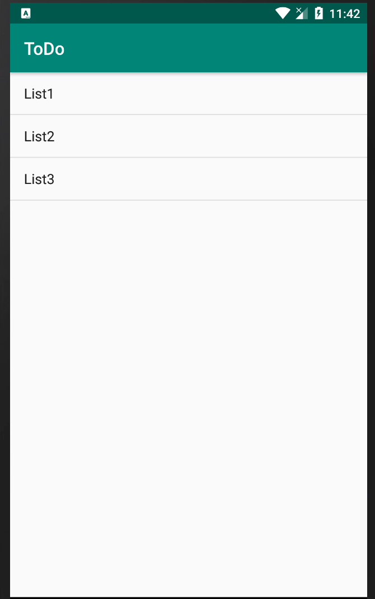
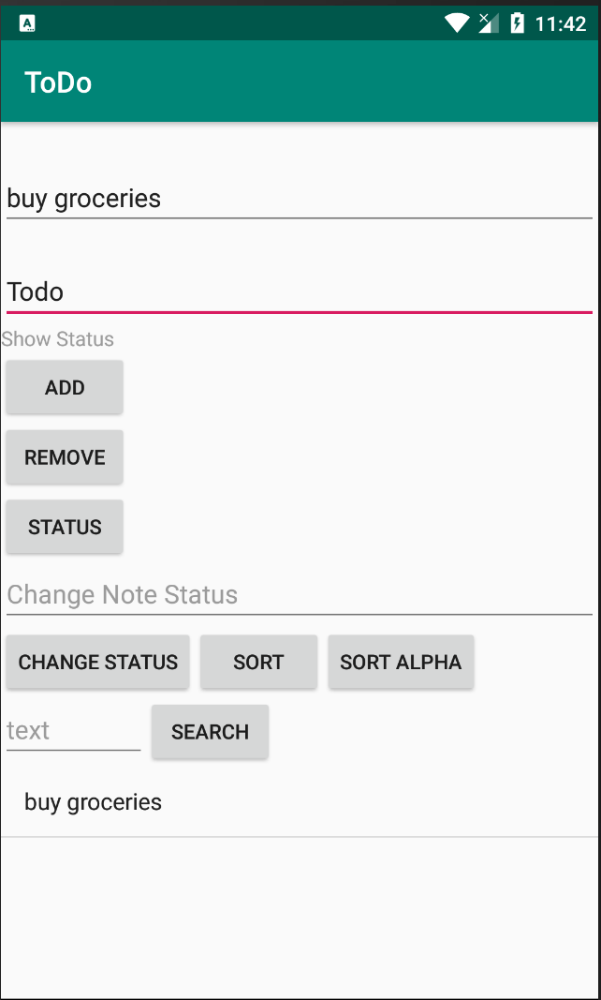
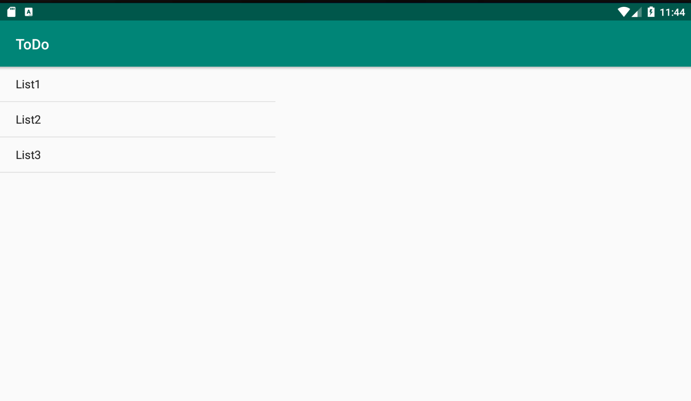
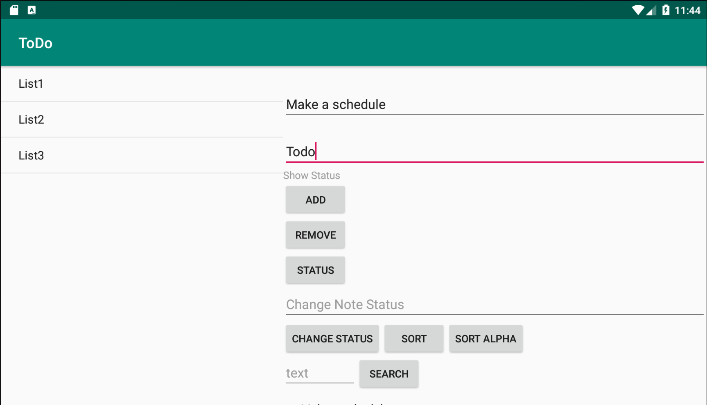
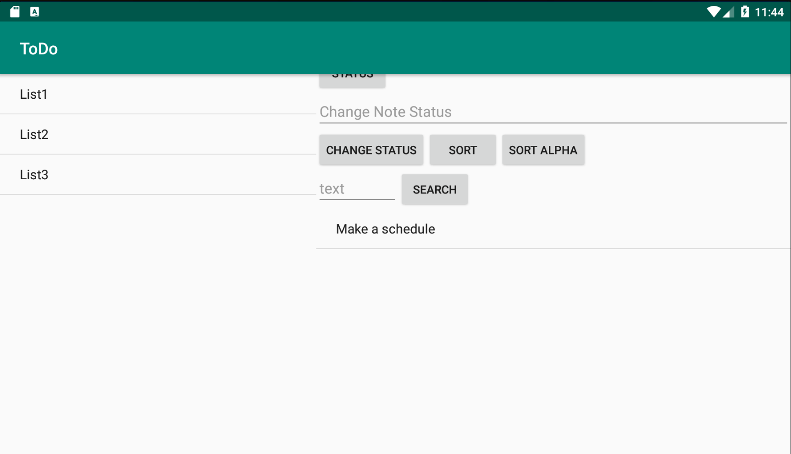

# AndroidNotesApp
A notes application on android, which works on a tablet as well as a phone

- The user has the ability to make notes and set a flag status also with them
The user can add,remove, search a note. They can also sort the notes alphabetically
or in their default order

-The app landing screen on the phone

- The tablet version of the application is the same

